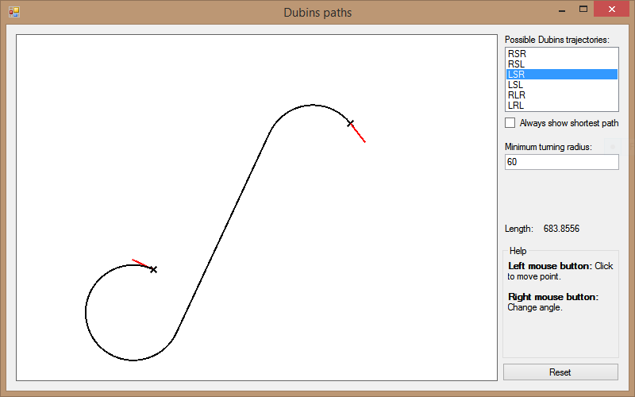
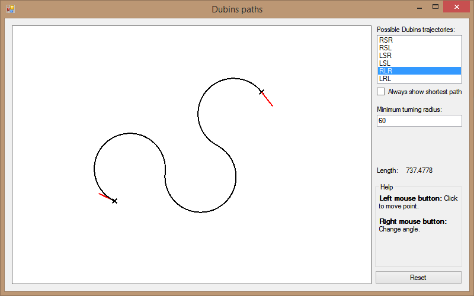
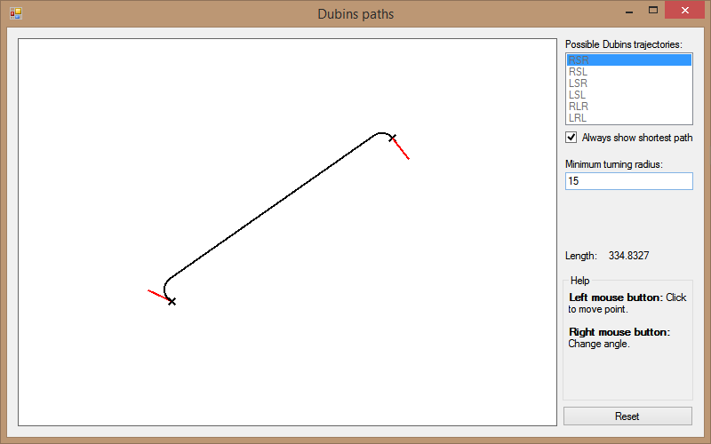

# Dubins Paths
Consider a car (or some kind of robot) that can only move forward and can not turn on the spot, but has a constraint on the maximum curvature of the paths it can follow. Given an initial point and a target point as well as the directions in which the system is facing at these positions, the optimal path between them is searched for.

The result will be a [Dubins path](https://en.wikipedia.org/wiki/Dubins_path) consisting of arcs with maximum curvature and possibly straight line segments connecting them.

#### Types
There are 6 types of these paths, divided in two categories: The ones made up by curves and straight lines (CSC) and ones that consist solely of arcs (CCC). The path types are abbreviated by naming their components using _L_ for a left turning arc, _S_ for a straight line and _R_ for a right turning arc. A Dubins path featuring a left turn followed by a straight segment followed by a right turn is thus be labelled a LSR-path.

#### Computing Dubins Paths
Because the calculation is so simple, they are often used to control small robots. If the initial and terminal conditions are known, the arcs are basically already defined by the minimum turning radius of the device, and everything that's left is the calculation of a line or a third circle tangent to the start and target circles.
There is an incredibly helpful tutorial at [Andy G's Blog](https://gieseanw.wordpress.com/2012/10/21/a-comprehensive-step-by-step-tutorial-to-computing-dubins-paths/), so I won't dive deeper into the exact calculations.

#### This Project
This project is essentially a test for me to learn how to implement the calculation and to visualize to concept. Two points and the direction they're facing in can be chosen, the software calculates the length of each path and the user may choose the one he wishes to display. In some cases, a path may not be defined at all - for example, when the start and target points are further apart than four radii, no circle tangent to the two others can be calculated. Also, no LSR respectively RSL path can be found, if the initial and terminal circles intersect.

Yeah... the minimum turning radius can be set and the software has the ability to always choose the shortest path type.

The most confusing part of this project was to render the paths (especially the arcs!) correctly. For my own functions, I used the mathematical notation of angles, that is I used radians and positive angles as counter-clockwise rotation. However .NETs `System.Drawing.Graphics.DrawArc()` function expects degrees, measured clockwise. Also, which I have not thought of in the beginning, is that the standard xy-Cartesian rotational matrix works with right-handed coordinate systems, whereas the coordinate system used for graphics is left-handed because of the inverted y-axis. Won't forget that again :sweat_smile:
